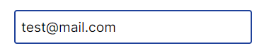
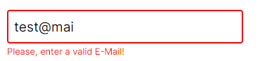

## HTML INPUT PATTERN ATTRIBUTE

 

> Form validation with just HTML and CSS

### What is the `pattern attribute`?

> The `pattern` attribute is an attribute of the text, tel, email, url, password, and search input types. [Vist MDN for more detailed explanation](https://developer.mozilla.org/en-US/docs/Web/HTML/Attributes/pattern)

### Examples :

1. Email Validation

   - RegExp :

   ```regexp
     ^\S+@\S+\.com+$
   ```

   - HTML:

   ```html
   <div class="input-field">
     <input
       placeholder="E-Mail"
       pattern="^\S+@\S+\.com+$"
       type="email"
       class="input-control"
     />
     <span>Please, enter a valid E-Mail!</span>
   </div>
   ```

   - <span id="css">CSS:</span>

   ```css
   .input-control {
     border: 2px solid #1e419a;
     width: 100%;
     height: 3rem;
     padding: 0.5rem;
     border-radius: 4px;
     font-size: 1.2rem;
     margin-bottom: 0.25rem;
     outline: none;
   }

   .input-control + span {
     display: none;
     font-size: 0.8rem;
     color: #fa0606;
   }

   .input-control:invalid {
     border: 2px solid #fa0606;
   }

   .input-control:invalid + span {
     display: block;
   }
   ```

   - Results:-

     - Valid: <br/>

       

     - Invalid: <br/>  
       

2. Full Name Validation

   - RegExp:

     ```regexp
     (\w+\s+){1,}\w+
     ```

     > The regular expression above matches 2 or more names as the valid input

   - HTML:

     ```html
     <div class="input-field">
       <input
         placeholder="Full Name"
         pattern="(\w+\s+){1,}\w+"
         type="text"
         class="input-control"
       />
       <span>Please, enter a valid full name</span>
     </div>
     ```

     - CSS :
       <a href="#css">Click to go back to style</a>

#### Links :-

- [View at CodePen](https://codepen.io/raheemscorp/pen/poVZoOZ)
- [View at StackBlitz](https://stackblitz.com/edit/web-platform-1aoslh?file=index.html)
